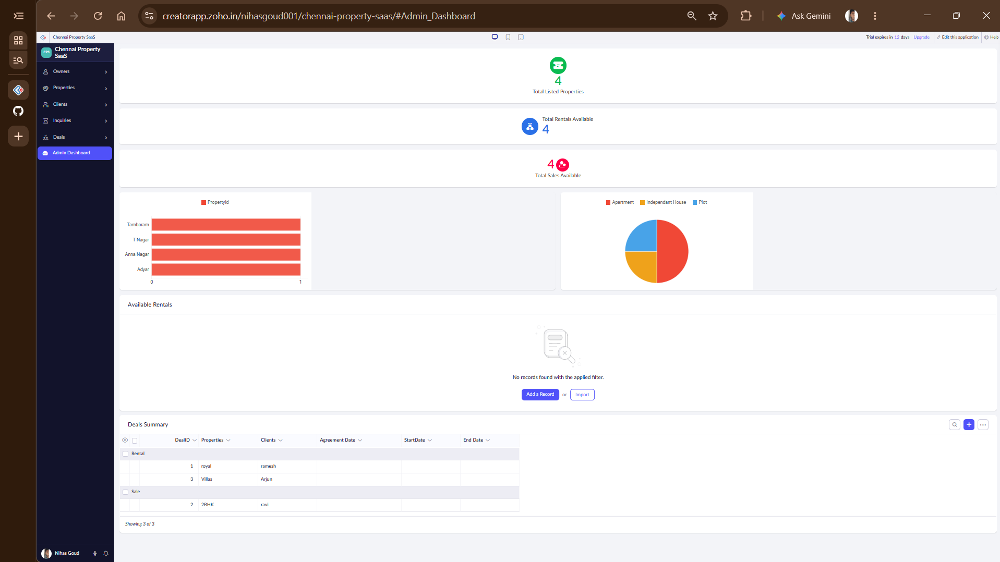
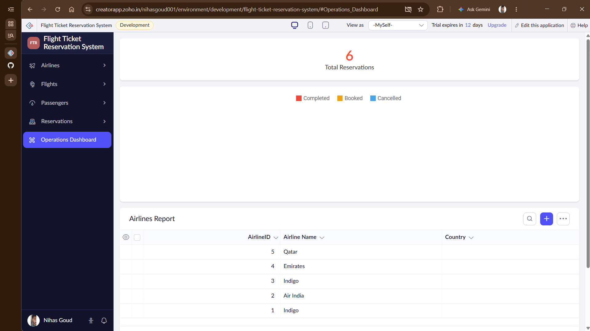

# Student Details
* **Name:** L Nihas Goud
* **Register Number:** 192472346
* **Course Code & Slot:** CSA1512 - Slot B
* **Faculty Name:** Dr. C. Rajesh Babu

## Guided Project Title
SaaS, Zoho Creator and GitHub Assessment Setup

## Objective
Learned the architectural layers of Software as a Service (SaaS), built a low-code cloud application prototype, and established version-controlled cloud documentation pipelines via GitHub.

## Project Reflection
Zoho Creator acts as a true SaaS product because the entire system architecture is remotely provisioned, hosted, and secure on Zoho's cloud servers. As a developer, I do not manage database infrastructure or local software updates; I focus exclusively on defining data layers, forms, and business logic from a standard web browser.
## Guided Project 01 Title
SaaS-Based Car Booking Platform (Zoho Creator)

## Objective
Designed a completely multi-tenant relational cloud database application featuring lookup foreign keys, conditional validation form rules, and dynamic real-time reporting views without drafting native manual source code.

## Project Reflection
This platform demonstrates Software as a Service (SaaS) principles by deploying a fully functional relational database directly to Zoho's managed cloud infrastructure. By linking our tables (Branches, Cars, Customers, and Bookings) using no-code lookups, we simulate foreign key constraints on the cloud. The client-side date validation workflow ensures logical data entry, showing how web-based SaaS environments automate DBMS concepts elastically with zero local installation.
---

## Guided Project 02: SaaS-Based Flight Ticket Reservation System

### Objective
Designed and deployed a multi-tenant relational cloud aviation database application featuring structural form lookups, conditional data reporting views, role-based configuration layers, and a live operational KPI dashboard without writing manual database source code.

### Architecture & SaaS Principles
1. **Multi-Tenancy & Data Isolation:** Utilizes customized built-in permission profiles (Admin, Airline Staff, Passenger) to dynamically partition user interfaces based on role identities, ensuring secure cross-tenant isolation within a singular shared application instance container.
2. **Relational Cloud Database Architecture:** Decoupled data collection forms function natively as back-end cloud relational database tables. Multi-layered Lookup controls establish structural foreign key mappings across the Airlines, Flights, Passengers, and Reservations collections to enforce relational entity integrity.
## 🏢 Project 03: Property Buying & Rental SaaS (Chennai Property SaaS)

### 🎯 Objective
Designed and deployed a multi-tenant cloud-based property management system for Chennai local database tracking (Adyar, Anna Nagar, etc.) using structural lookups, automated no-code form rules, and role-isolated data containers.

### 🛠️ Cloud Database Architecture & Schemas
* **Owners Master:** Auto-generated `OwnerID` primary key, contact channels, and encrypted `KYCDOC` storage.
* **Properties Registry:** Relational mapping linking property assets directly to owners via form lookups. Implements structural rules to dynamically require financial arrays based on listing attributes (Sale vs. Rental).
* **Clients & Inquiries:** Dynamic multi-select tracking matching buyer/tenant budget ranges and location matrices against active inventory listings.
* **Deals Ledger:** Final operational layer securing transactional records (Sale/Rental) with contextual field display constraints.

### 🔒 SaaS Multi-Tenancy & Data Partitioning
* **Role-Based Configuration:** Implements explicit authorization boundaries separating Admin, Agent, Owner, and Client profiles.
* **Data Isolation Layers:** Embeds record-level runtime filters (`Owner == Logged-in User` and `Client == Logged-in User`) ensuring strict multi-tenant privacy inside a unified system runtime instance.

### 📸 Project Artifacts
* **Admin Analytics Command Hub:**
  

---

## ✈️ Project 02: Flight Ticket Reservation System

### 🎯 Objective
Designed and deployed a multi-tenant cloud aviation database application featuring structural form lookups, conditional data reporting views, and role-based configuration layers.

### 📸 Project Artifacts
* **Operations Command Hub:**
  
4. **Zero-Install Elastic Infrastructure:** The platform operates strictly on Zoho's fully managed remote cloud infrastructure, delivering instant cross-platform accessibility with automated resource scaling.

### Project Artifacts
* **Live System Screenshot:** `flight_reservation_dashboard.png`
